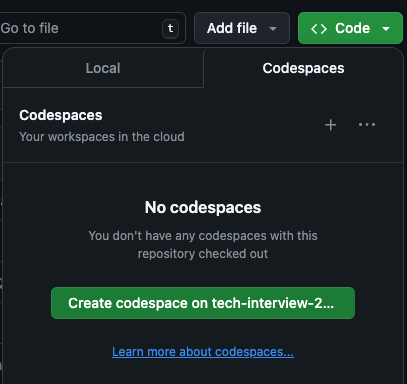

# Welcome to RC
Talk us through your thinking process. If you have any question, feel free to ask for clarification.
## Questions
### 1. How does HTTP work?

### 2.

### 3. Coding question
We will be using GitHub Codespaces for the following questions, please create a codespaces by clicking the dropdown `Use this template` -> `Open in codespaces` at top right of the Github Repo.


### Q1
<!-- 10 min -->
Please change the line `GitHub Codespaces ♥️ Flask` to `I ♥️ Flask` in the index

### Q2
<!-- 10 min -->
<!-- Have existing code snippet to add to app.py, and file -->
Please paste the following code to `app.py` and go visit the page `/add` and make sure the addition function works correctly.

```python
# file: app.py

@app.route("/add", methods=['GET'])
def add():
    answer = 0
    if request.method == "POST":
        answer = request.form.get("num1") + request.form.get("num2")
    return render_template("add.html", title="Addition", answer=answer)
```
<!-- The answer is not what we expected -->

### Q3
<!-- 10 min -->
<!-- Adding API to get task list -->
Please implement the function `todo` that reads tasks from file `tasks.csv` and return a list of tasks. Visit the page `/todo` to make sure you get the correct list of todo tasks.

```python
# file: app.py

@app.route("/todo", methods=['GET'])
def todo():
    # Your code
    return flask.jsonify(d)
```

#### Q3.1
<!-- 10 min -->
Add sorting to the todo list with date and/or priority

### Q4
<!-- 10 min -->

```python
# file: app.py

@app.route("/todo", methods=['POST'])
def add_todo():
    # Your code
    return result
```
Please implement the function `add_todo` that will take `POST` request, and add the task name from `request.form.get("task_name")` to the file `tasks.csv`

### Bonus Question
<!-- 10 min -->
Modify the `todo` function to read tasks from SQLite database.